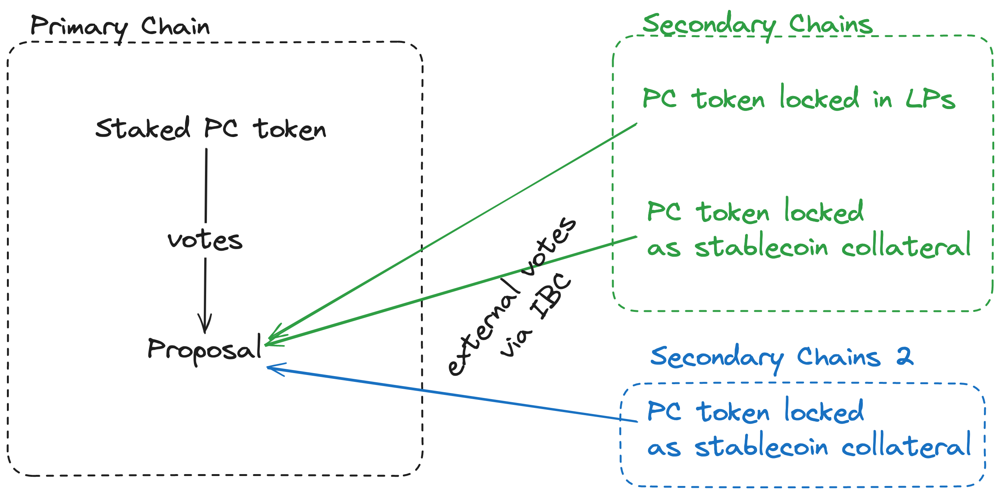
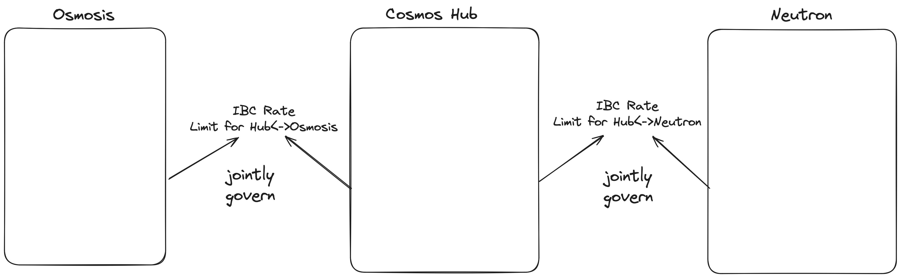
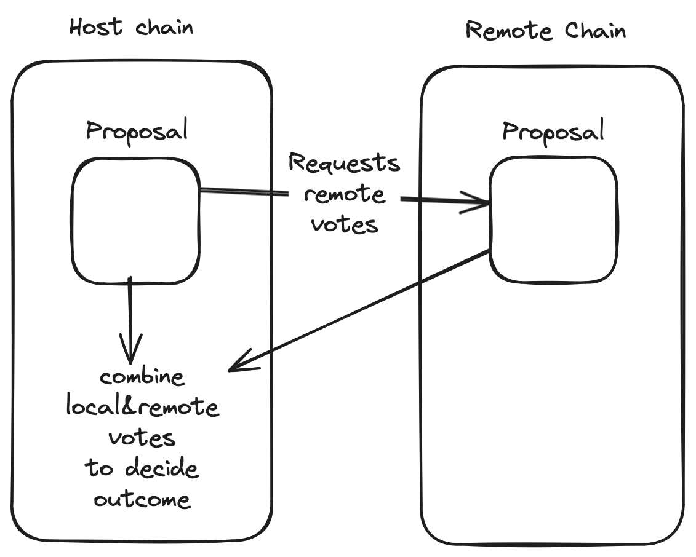
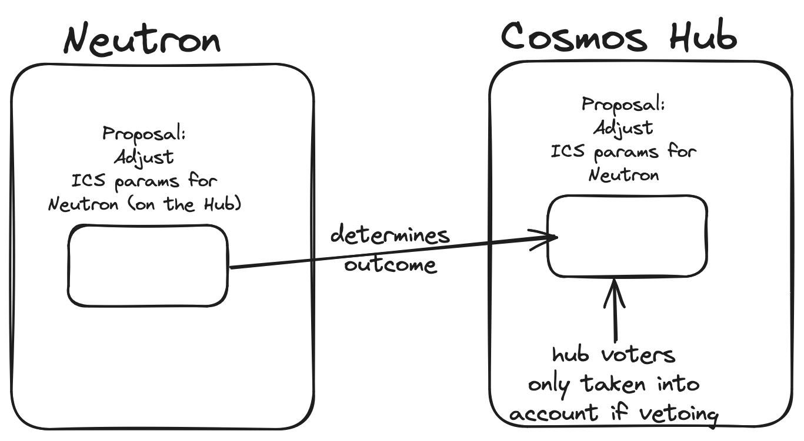

# Cross Chain Governance

Blockchains are becoming more and more interconnected.
While today, governance on a chain is typically tied to assets that are present *on* that chain.
For example, the Cosmos Hub is governed only by Atom that is locked as stake on the Cosmos Hub.
As DeFi applications become more popular
and with the rise of shared security solutions such as Babylon and Eigenlayer (providing security with locked Bitcoin and Ethereum respectively),
less stake needs to be locked on the chain to provide security, and assets can instead be more freely used in DeFi applications.

If these assets are still sufficiently tied to their origin chain, we likely want them to be able to participate in governance.
For example, Atom that is locked in LP pools on Osmosis is doing an important job providing liquidity to the network,
so it is important if those funds can still participate in governance, even if they are directly providing security.



Additionally, we also want more expressivity for cross-chain agreements.
For example, the Cosmos Hub is an interchain security provider chain and gives security to consumer chains like Neutron.
Some parameters on the Hub might have immediate impacts on Neutron, and it would be useful if Neutron could have a say in those parameters.
In turn, for some proposals on Neutron, it might want to give the Hub a say in the decision.
One prominent example are IBC rate limits. The rate limits on both chains could be different,
but in the case of light-client attacks, the rate limit on the receiver side
actually safeguards the sender chain, so these parameters are perfectly suited
to be jointly owned by the sender and receiver.



## Architecture



There is one main contract on each chain that is responsible for voting on and executing proposals.
Each proposal has a list of `PrerequisiteRemoteProposals` that need to have finished on the remote chain before
the final outcome of the proposal is known.
When the voting period of a proposal is passed, anyone can permissionlessly `Execute` the proposal to tally the votes (and pay gas for this).
If there is a prerequisite remote proposal that we have not gotten the results for yet,
the execution will fail, but the contract instead *queries* the remote prerequisite proposal contract for the result.
Once the host chain has received the results of all prerequisite remote proposals, trying to `Execute` the proposal
will succeed and determine the final outcome.

The voting power of voting users is provided by an additional `VotingPowerSource` contract.
For now, there is just an implementation of a simple power source contract that gives each user a fixed voting power;
in reality, these contracts would query e.g. the user's stake on the chain, the LP tokens they have locked in a certain pool, etc.

Right now, the contract just sums the votes for all remote prerequisite proposals with the local votes
and uses that to determine the outcome, but in principle there could be more complicated logic.
One example would be having Neutron stakers vote on a proposal on the hub, but the hub having a veto right.



## Example

Here is some example code that tests the module, using cw-orchestrator to facilitate IBC.
Omitting some setup and boilerplate code, the main part of the test looks like this:

We first crate a proposal on Chain A:
```rust
// create proposal on chain A
let create_prop_response = a_app.create_proposal(
    "cosmwasm is awesome".to_string(),
    vec!["approve".to_string(), "reject".to_string()],
    a_fixed_power_addr.to_string(),
    vec![], // no prerequisites
    "test".to_string(),
);
```
Then, let's create a proposal on Chain B that has this proposal as a prerequisite:

```rust
 b_app.create_proposal(
        "cosmwasm is awesome".to_string(),
        vec!["approve".to_string(), "reject".to_string()],
        b_fixed_power_addr.to_string(),
        vec![( // reference the prerequisite proposal on chain A
            0,
            "harpoon".to_string(),
            a_app.as_instance().address()?.to_string(),
        )],
        "test".to_string(),
    );
```

We vote on both chains...
```rust
 // vote on chain A
let vote_response = a_app.vote("approve".to_string(), 0);

// vote on chain B
let vote_response = b_app.vote("reject".to_string(), 0);
```

Let's advance time to pass the voting period for both proposals...
```rust

```

Let's execute the proposal on chain B...
```rust
// try to execute proposal on chain B
let execute_proposal_response = b_app.execute_proposal(0)?;

// should fail because the proposal on chain A was not executed. we try to query the remote proposal, but this fails, so we get an event to the effect.
assert!(
    execute_proposal_response.has_event(&Event::new("wasm-remote_proposal_unresolved")),
    "{:?}",
    execute_proposal_response
);
```

but that fails because the proposal on chain A has not been executed yet and its a prerequisite.

Now, let's execute the proposal on chain A...

```rust
// execute the proposal on chain A
let execute_proposal_response = a_app.execute_proposal(0)?;
```

then retry the execution on chain B. This will *also* not succeed, but this time we are sending an IBC query to chain A and receive the result of the proposal.

```rust
// now try to execute the proposal on chain B
let execute_proposal_response = b_app.execute_proposal(0)?;
```

So once the message is relayed, we can retry the execution on chain B and it will succeed.

```rust
interchain.check_ibc(B_CHAIN_ID, execute_proposal_response)?;

// now try to execute the proposal on chain
let execute_proposal_response = b_app.execute_proposal(0)?;

// query the proposal tally in the store
let mut query_tally_response = b_app.query_tally(0)?;

// sort the tallies
query_tally_response.tally.sort();

let mut expected_tally = vec![("reject".to_string(), 1), ("approve".to_string(), 1)];
expected_tally.sort();

assert_eq!(query_tally_response.tally, expected_tally);
```

We can see that both the votes from chain A and chain B are tallied together to determine the final outcome.

You can run this test yourself by running `cargo test`.